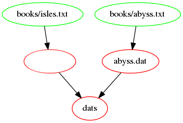
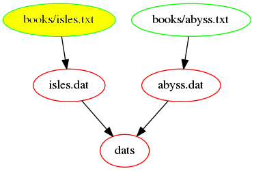
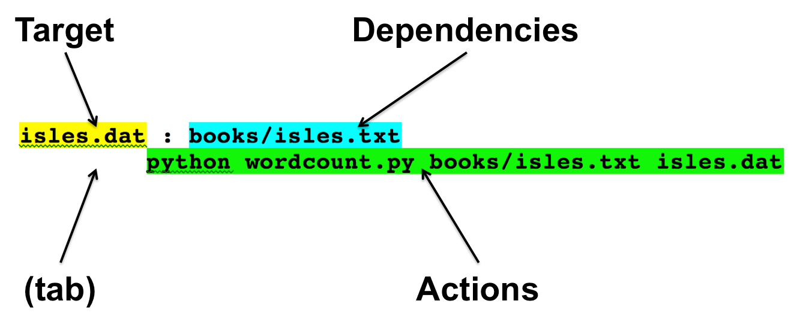
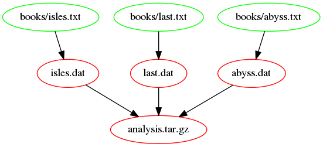
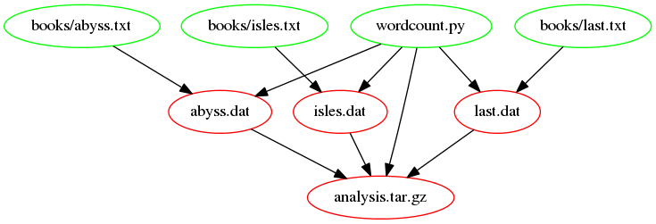
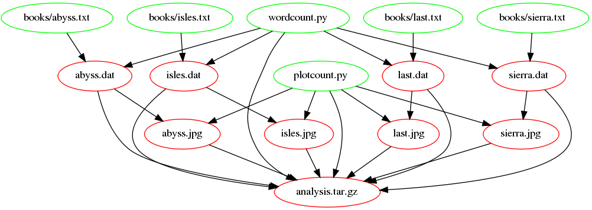

# 2015-11-16 CoDiMa workshop: `Make`


---

## `Make`

----

### `Make`

**[Make](http://www.gnu.org/software/make/) is a *[build manager](http://swcarpentry.github.io/make-novice/reference.html#build-manager)***

* tracks *[targets](http://swcarpentry.github.io/make-novice/reference.html#target)* to be 'built'
* tracks *[dependencies](http://swcarpentry.github.io/make-novice/reference.html#dependency)* needed to build the targets


* *targets* and *dependencies* defined in a *[build file](http://swcarpentry.github.io/make-novice/reference.html#build-file)* or *[`Makefile`](http://swcarpentry.github.io/make-novice/reference.html#makefile)*

----

### `Make`

- If a *target* is missing, that target is built



----

### `Make`

- If *dependencies* change, the target is rebuilt/updated



(is a *dependency* newer than its target?)

----

### Can I use something else?

- This is a very common job. Many tools exist based on same fundamental concepts:

  * [`Apache ANT`](http://ant.apache.org/)
  * [`doit`](http://pydoit.org/)
  * [`nmake`](https://msdn.microsoft.com/en-us/library/dd9y37ha.aspx) (Windows)

- build script builders:

  * [`GNU autoconf`](http://www.gnu.org/software/autoconf/autoconf.html)
  * [`CMake`](http://www.cmake.org/)

----

### When are build tools used?

* compilation of source code
* run analyses on raw data (*e.g. bioinformatics pipelines*)
* run visualisation scripts on analysis output
* combine text/figures to produce papers/presentations

---

## Getting ready

----

### Lesson files

For this lesson, you need to download some files:

1. Download [`make-lesson.tar.gz`](http://swcarpentry.github.io/make-novice/make-lesson.tar.gz) ([http://swcarpentry.github.io/make-novice/make-lesson.tar.gz](http://swcarpentry.github.io/make-novice/make-lesson.tar.gz))
2. Move `make-lesson.tar.gz` into a directory you can use with the `bash` shell


----

### Lesson files

1. Open a `bash` shell window
2. Navigate to the directory containing `make-lesson.tar.gz`
3. Unpack the `make-lesson.tar.gz` archive and change directory to `make-lesson`

```bash
$ tar -xvf make-lesson.tar.gz
$ cd make-lesson
```


----

### Does `Make` work?

```bash
$ make
make: *** No targets specified and no makefile found.  Stop.
$ make -h
Usage: make [options] [target] ...
[…]
```


---

## Automation and `Make`

----

### Data analysis example

* Suppose we have a script `wordcount.py` that reads in a text (`.txt`) file, counts the words in that file, and writes out a data (`.dat`) file.

* We might run this script on one file, e.g. `isles.txt`:

```bash
$ python wordcount.py books/isles.txt isles.dat
$ head -5 isles.dat
the 3822 6.7371760973
of 2460 4.33632998414
and 1723 3.03719372466
to 1479 2.60708619778
a 1308 2.30565838181
```


----

### Data analysis example

…and then on another file, e.g. `abyss.txt`:

```bash
$ python wordcount.py books/abyss.txt abyss.dat
$ head -n 5 abyss.dat
the 4044 6.35449402891
and 2807 4.41074795726
of 1907 2.99654305468
a 1594 2.50471401634
to 1515 2.38057825267
```


----

### Visualisation example

The script `plotcount.py` visualises the analysis by drawing a barchart of the 10 most frequent words:


```bash
$ python plotcount.py isles.dat show
```


This can be used to write an image (`.jpg`) file:

```bash
$ python plotcount.py isles.dat isles.jpg
```


----

### Example output


----

### Analysis and visualisation workflow

1. Read a data file
2. Perform analysis on data
3. Write results to new file
4. Visualise results
5. Write visualisation to file (for publication)

----

### Automating workflows

- **Problem:** CLI is fine for a couple of files, but for 5, 20, 100?

- **Solution:** Automate the workflow

----

### Script vs `Make`

* Shell script:
  * loop over inputs, and generate outputs
  * ***but*** what if only one input changes?
* `Make`
  * only rebuilds if a *dependency* changes
  * only rebuilds *targets* that are missing or affected by changes
  * self-documenting
  

---

## Makefiles

----

### Create a `Makefile`

Create a file called `Makefile` with the following contents:

```text
# Count words.
isles.dat : books/isles.txt
        python wordcount.py books/isles.txt isles.dat
```


----

### Elements of a `Makefile`

```text
# Count words.
isles.dat : books/isles.txt
        python wordcount.py books/isles.txt isles.dat
```

* `#` is a *comment*. The rest of the line is ignored by `Make`

----

### Elements of a `Makefile`

```text
# Count words.
isles.dat : books/isles.txt
        python wordcount.py books/isles.txt isles.dat
```

* `isles.dat` is the [*target*](http://swcarpentry.github.io/make-novice/reference.html#target): a file to be created, or built.
* `books/isles.txt` is a [*dependency*](http://swcarpentry.github.io/make-novice/reference.html#dependency): a file required to buid or update the target
* `:` is a *separator*, separating targets from dependencies

----

### Elements of a `Makefile`

```text
# Count words.
isles.dat : books/isles.txt
        python wordcount.py books/isles.txt isles.dat
```


* `python wordcount.py books/isles.txt isles.dat` is an [*action*](http://swcarpentry.github.io/make-novice/reference.html#action) - the command(s) to build the *target* using the *dependencies*.

* **GOTCHA:** The gap in front of the *action* is a `TAB` character, not a set of spaces!

```bash
$ make
Makefile:3: *** missing separator (did you mean TAB instead of 8 spaces?).  Stop.
```

----

### Elements of a `Makefile`

```text
# Count words.
isles.dat : books/isles.txt
        python wordcount.py books/isles.txt isles.dat
```

- Together, the target, dependencies and actions comprise a [`rule`](http://swcarpentry.github.io/make-novice/reference.html#rule).

----

### Elements of a `Makefile` rule



----

### Live coding exercises

Follow at [http://kkwakwa.github.io/2015-11-16-manchester-codima/2015-11-16-make-lesson](http://kkwakwa.github.io/2015-11-16-manchester-codima/2015-11-16-make-lesson)

(see [course EtherPad](http://pad.software-carpentry.org/2015-11-16-manchester-codima) for the link)


----

### Question: Why do dependencies change?

How does `Make` know that a dependency has changed?

1. It keeps a copy of the original data and compares it to what's on disk
2. It checks whether the dependency is newer than the target
3. You need to tell `Make` what has updated when you run it
4. The operating system keeps a list of what you've done, and `Make` looks at this

----

### Live coding exercises

Follow at [http://kkwakwa.github.io/2015-11-16-manchester-codima/2015-11-16-make-lesson](http://kkwakwa.github.io/2015-11-16-manchester-codima/2015-11-16-make-lesson)

(see [course EtherPad](http://pad.software-carpentry.org/2015-11-16-manchester-codima) for the link)


----

### Question: Target is not a file

We don't make a `clean` file. What happens if a file called `clean` exists?

1. `Make` ignores it and runs the rule
2. `Make` deletes the file
3. `Make` assumes that target was built already and stops
4. `Make` gives an error

----

### Live coding exercises

Follow at [http://kkwakwa.github.io/2015-11-16-manchester-codima/2015-11-16-make-lesson](http://kkwakwa.github.io/2015-11-16-manchester-codima/2015-11-16-make-lesson)

(see [course EtherPad](http://pad.software-carpentry.org/2015-11-16-manchester-codima) for the link)


----

### `Makefile`

```bash
# Count words.
.PHONY : dats
dats : isles.dat abyss.dat

isles.dat : books/isles.txt
        python wordcount.py books/isles.txt isles.dat

abyss.dat : books/abyss.txt
        python wordcount.py books/abyss.txt abyss.dat

.PHONY : clean
clean :
        rm -f *.dat
```


----

### `Makefile` dependency graph


----

### Exercise (10min): Write two new rules

* Write a new rule to make `last.dat`, created from `books/last.txt`.
* Update the `dats` rule with this target.
* Write a new rule for `analysis.tar.gz`, which creates an archive of the data files. The rule needs to:
  1. Depend upon each of the *three* `.dat` files.
  2. Invoke the action 
  ```bash
  tar -czf analysis.tar.gz isles.dat abyss.dat last.dat
  ```
  3. Update `clean` to remove `analysis.tar.gz`.


----

### Dependency graph

- The dependency graph for our `Makefile` now looks like this:




---

## Automatic variables

----

### Reducing duplication

```bash
# Count words.
.PHONY : dats
dats : isles.dat abyss.dat last.dat

isles.dat : books/isles.txt
        python wordcount.py books/isles.txt isles.dat

abyss.dat : books/abyss.txt
        python wordcount.py books/abyss.txt abyss.dat

last.dat : books/last.txt
        python wordcount.py books/last.txt last.dat

# Generate archive file.
analysis.tar.gz : isles.dat abyss.dat last.dat
        tar -czf analysis.tar.gz isles.dat abyss.dat last.dat

.PHONY : clean
clean :
        rm -f *.dat
        rm -f analysis.tar.gz
```

* names are repeated in many places
* repeated names can lead to problems (e.g. forgetting to rename after a change)

----

### `$@`: target of current rule

```bash
analysis.tar.gz : isles.dat abyss.dat last.dat
        tar -czf analysis.tar.gz isles.dat abyss.dat last.dat
```

* `$@` is a [`Make` automatic variable](http://swcarpentry.github.io/make-novice/reference.html#automatic-variable) that means "the target of the current rule"

```bash
analysis.tar.gz : isles.dat abyss.dat last.dat
        tar -czf $@ isles.dat abyss.dat last.dat
```


----

### `$^`: dependencies of current rule

```bash
analysis.tar.gz : isles.dat abyss.dat last.dat
        tar -czf $@ isles.dat abyss.dat last.dat
```

* `$^` is a [`Make` automatic variable](http://swcarpentry.github.io/make-novice/reference.html#automatic-variable) that means "the dependencies of the current rule"

```bash
analysis.tar.gz : isles.dat abyss.dat last.dat
        tar -czf $@ $^
```

----

### Live coding exercises

Follow at [http://kkwakwa.github.io/2015-11-16-manchester-codima/2015-11-16-make-lesson](http://kkwakwa.github.io/2015-11-16-manchester-codima/2015-11-16-make-lesson)

(see [course EtherPad](http://pad.software-carpentry.org/2015-11-16-manchester-codima) for the link)


----

### Question: Using bash `*` wildcard

What happens if we specify dependencies:

```
analysis.tar.gz : *.dat
         tar -czf $@ $^
```

and issue:

```
make analysis.tar.gz
```

1. `Make` builds the archive
2. `Make` doesn't understand `*.dat`
3. `Make` can't find the file(s) `*.dat`
4. `Make` builds the `*.dat` files and the archive

----

### Live coding exercises

Follow at [http://kkwakwa.github.io/2015-11-16-manchester-codima/2015-11-16-make-lesson](http://kkwakwa.github.io/2015-11-16-manchester-codima/2015-11-16-make-lesson)

(see [course EtherPad](http://pad.software-carpentry.org/2015-11-16-manchester-codima) for the link)


----

### Question: Using bash `*` wildcard

- What happens if we delete the `*.dat` files and issue

```
make analysis.tar.gz
```

1. `Make` builds the archive only
2. `Make` builds the `*.dat` files only
3. `Make` can't find the file(s) `*.dat`
4. `Make` builds the `*.dat` files and the archive

----

### Live coding exercises

Follow at [http://kkwakwa.github.io/2015-11-16-manchester-codima/2015-11-16-make-lesson](http://kkwakwa.github.io/2015-11-16-manchester-codima/2015-11-16-make-lesson)

(see [course EtherPad](http://pad.software-carpentry.org/2015-11-16-manchester-codima) for the link)


----

### Question: Updating dependencies

What will happen if you now execute:

```bash
$ touch *.dat
$ make analysis.tar.gz
```

1. nothing
2. all files recreated
3. only `.dat` files recreated
4. only `analysis.tar.gz` recreated

----

### `$<`: first dependency of current rule

We may want to treat the first dependency of a rule differently.

```bash
isles.dat : books/isles.txt
        python wordcount.py books/isles.txt isles.dat
```

* `$<` is a [`Make` automatic variable](http://swcarpentry.github.io/make-novice/reference.html#automatic-variable) that means "the first dependency of the current rule"

----

### Exercise (5min): Rewrite `.dat` rules

Rewrite each `.dat` rule to use the automatic variables 

* `$@` (‘the target of the current rule’)
* `$<` (‘the first dependency of the current rule’).


---

## Dependencies on data and code

----

### Code is also a dependency

```bash
# Count words.
.PHONY : dats
dats : isles.dat abyss.dat last.dat

isles.dat : books/isles.txt
    python wordcount.py $< $@

abyss.dat : books/abyss.txt
    python wordcount.py $< $@

last.dat : books/last.txt
    python wordcount.py $< $@

# Generate archive file.
analysis.tar.gz : *.dat
    tar -czf $@ $^

.PHONY : clean
clean :
        rm -f *.dat
        rm -f analysis.tar.gz
```

- In our `Makefile`, the output is a product of the input data files, *but also of the code*
- If `wordcount.py` changes, the output may also change. 

----

### Live coding exercises

Follow at [http://kkwakwa.github.io/2015-11-16-manchester-codima/2015-11-16-make-lesson](http://kkwakwa.github.io/2015-11-16-manchester-codima/2015-11-16-make-lesson)

(see [course EtherPad](http://pad.software-carpentry.org/2015-11-16-manchester-codima) for the link)


----

### Dependency graph

The dependency graph for our `Makefile` now looks like this:



----

### Question:

Why don’t the `.txt` files depend on `wordcount.py`?

----

### Live coding exercises

Follow at [http://kkwakwa.github.io/2015-11-16-manchester-codima/2015-11-16-make-lesson](http://kkwakwa.github.io/2015-11-16-manchester-codima/2015-11-16-make-lesson)

(see [course EtherPad](http://pad.software-carpentry.org/2015-11-16-manchester-codima) for the link)


---

## Pattern rules

----

###  Reducing duplication

- Our `Makefile` still has repetition in the `*.dat` rules, which vary only by input and output file name:

```bash
# Count words
.PHONY : dats
dats : isles.dat abyss.dat last.dat

isles.dat : books/isles.txt wordcount.py
	python wordcount.py $< $@

abyss.dat : books/abyss.txt wordcount.py
	python wordcount.py $< $@

last.dat : books/last.txt wordcount.py
	python wordcount.py $< $@

# Generate archive file
analysis.tar.gz : *.dat
	tar -cvf $@ $^

.PHONY : clean
clean :
	rm -f *.dat
```

We can replace all three with a single [pattern rule](http://swcarpentry.github.io/make-novice/reference.html#pattern-rule).

----

### `%`: the `Make` wildcard

```bash
isles.dat : books/isles.txt wordcount.py
	python wordcount.py $< $@

abyss.dat : books/abyss.txt wordcount.py
	python wordcount.py $< $@

last.dat : books/last.txt wordcount.py
	python wordcount.py $< $@
```

* `%` is a special character: the `Make` [wildcard](http://swcarpentry.github.io/make-novice/reference.html#wild-card), used only in targets and dependencies
* `$*` is a *special variable* that is replaced by the [stem](http://swcarpentry.github.io/make-novice/reference.html#stem) that matches the `%` wildcard.

```bash
%.dat : books/%.txt wordcount.py
        python wordcount.py $< $*.dat
```


----

### `Makefile`

Our `Makefile` is much shorter and cleaner:

```bash
# Count words.
.PHONY : dats
dats : isles.dat abyss.dat last.dat

%.dat : books/%.txt wordcount.py
    python wordcount.py $< $*.dat

# Generate archive file.
analysis.tar.gz : *.dat wordcount.py
    tar -czf $@ $^

.PHONY : clean
clean :
        rm -f *.dat
        rm -f analysis.tar.gz
```

---

## `Make` variables

----

### Variable assignment

- `Make` [variables](http://swcarpentry.github.io/make-novice/reference.html#variable) (sometimes called '[macros](http://swcarpentry.github.io/make-novice/reference.html#macro)') are defined by [*assignment*](http://swcarpentry.github.io/make-novice/reference.html#assignment).

```bash
VAR=value
```

- The variable `VAR` is assigned the value `value`, and is referenced as:

```bash
$(VAR)
```

----

### Reducing duplication

Our `Makefile` still has some duplication: `wordcount.py`

```bash
# Count words.
.PHONY : dats
dats : isles.dat abyss.dat last.dat

%.dat : books/%.txt wordcount.py
    python wordcount.py $< $*.dat

# Generate archive file.
analysis.tar.gz : *.dat wordcount.py
    tar -czf $@ $^

.PHONY : clean
clean :
        rm -f *.dat
        rm -f analysis.tar.gz
```

----

### Assigning variables

Assigning a variable for the script `wordcount.py`:

```bash
COUNT_SRC=wordcount.py
```

- The script is invoked by passing it to `python`.

- We can use another variable for this:

```bash
COUNT_EXE=python $(COUNT_SRC)
```

----

### Exercise (10min): Use variables

- Update `Makefile` so that the `%.dat` and `analysis.tar.gz` rules reference the variables `COUNT_SRC` and `COUNT_EXE`.


----

### Modular code

- Placing variables at the top of a `Makefile` is convenient. 

- An alternative approach is to create a new Makefile, a *configuration file*, that holds only variable definitions.

- Now, if we want to change a script name, we need only modify a configuration file, not the source code.

***Decoupling code from configuration is good programming practice***

----

### Modular code

* Create a file `config.mk` containing the following:

```bash
# Count words script.
COUNT_SRC=wordcount.py
COUNT_EXE=python $(COUNT_SRC)
```

Import this file into `Makefile` using:

```bash
include config.mk
```


---

## `Make` functions

----

### `Makefile`

Our `Makefile`:

```bash
include config.mk

# Count words.
.PHONY : dats
dats : isles.dat abyss.dat last.dat

%.dat : books/%.txt $(COUNT_SRC)
    $(COUNT_EXE) $< $*.dat

# Generate archive file.
analysis.tar.gz : *.dat $(COUNT_SRC)
    tar -czf $@ $^

.PHONY : clean
clean :
        rm -f *.dat
        rm -f analysis.tar.gz
```


----

### `wildcard`

- The `wildcard` [function](http://swcarpentry.github.io/make-novice/reference.html#function) gets a list of files that match a pattern, so they can be saved in a variable:

```bash
TXT_FILES=$(wildcard books/*.txt)
```

- We can use a `.PHONY` target to show the value of the variable:

```bash
.PHONY : variables
variables :
    @echo TXT_FILES: $(TXT_FILES)
```


----

### Question:

```bash
.PHONY : variables
variables :
    @echo TXT_FILES: $(TXT_FILES)
```

Why do we need to use `@echo`, rather than `echo`?

----

### Live coding exercises

Follow at [http://kkwakwa.github.io/2015-11-16-manchester-codima/2015-11-16-make-lesson](http://kkwakwa.github.io/2015-11-16-manchester-codima/2015-11-16-make-lesson)

(see [course EtherPad](http://pad.software-carpentry.org/2015-11-16-manchester-codima) for the link)


----

### Dependency graph

- All the `books/*.txt` files are included in our dependencies:


----

### `patsubst`

* The `patsubst` [function](http://swcarpentry.github.io/make-novice/reference.html#function) takes a *pattern*, a *replacement string*, and a list of *names*.
* Each *name* in the list that matches the *pattern* is replaced by the *replacement string*.

```bash
DAT_FILES=$(patsubst books/%.txt, %.dat, $(TXT_FILES))
```

We can extend the `variables` target to show this:

```bash
.PHONY : variables
variables:
    @echo TXT_FILES: $(TXT_FILES)
    @echo DAT_FILES: $(DAT_FILES)
```


----

### Live coding exercises

Follow at [http://kkwakwa.github.io/2015-11-16-manchester-codima/2015-11-16-make-lesson](http://kkwakwa.github.io/2015-11-16-manchester-codima/2015-11-16-make-lesson)

(see [course EtherPad](http://pad.software-carpentry.org/2015-11-16-manchester-codima) for the link)


----

### Final `Makefile`

```bash
include config.mk

TXT_FILES=$(wildcard books/*.txt)
DAT_FILES=$(patsubst books/%.txt, %.dat, $(TXT_FILES))

.PHONY: variables
variables:
    @echo TXT_FILES: $(TXT_FILES)
    @echo DAT_FILES: $(DAT_FILES)

# Count words.
.PHONY : dats
dats : $(DAT_FILES)

%.dat : books/%.txt $(COUNT_SRC)
    $(COUNT_EXE) $< $*.dat

# Generate archive file.
analysis.tar.gz : $(DAT_FILES) $(COUNT_SRC)
    tar -czf $@ $^

.PHONY : clean
clean :
    rm -f $(DAT_FILES)
    rm -f analysis.tar.gz
```


---

## Conclusion

----

### How does `Make` help?

* automates repetitive commands, reducing risk of error
* outputs are only created when inputs/dependencies have changed
  * synchronising data/inputs with outputs
  * saving time
* code acts as documentation, recording dependencies between code, data, and outputs
* parallelisation (`make -j 4 analysis.tar.gz`)

----

### Exercise (15min): Create `.jpg`s

* Add new rules, update existing rules, and add new macros to:
  1. Create `.jpg` files from `.dat` files using `plotcount.py`.
  2. Add the script and `.jpg` files to the archive.
  3. Remove all automatically-generated files (`.dat`, `.jpg`, `analysis.tar.gz`).


----

### Final dependencies


